# Projet DevOps · velos-api

**Nom et prénom :** Charles-Édouard  
**Groupe :** DAT 26.1
**Dépôt :** `DLuffy07/velos-api`  
**Image publiée :** `charlic109/velos-api`  
**Date de rendu :** 28/08/2026  

---

## 1. Ce que j'ai construit, en cinq lignes

J'ai construit une API Flask nommée `velos-api`, conteneurisée avec Docker et connectée à une base PostgreSQL.  
Docker Compose fournit un environnement local reproductible avec l'API et la base de données.  
L'application est ensuite déployée dans un cluster Kubernetes Kind multi-nœuds avec plusieurs réplicas.  
Les images de l'application sont publiées sur Docker Hub sous `charlic109/velos-api`.  
Enfin, Jenkins automatise les tests, la construction de l'image, sa publication et son déploiement dans Kubernetes.

La chaîne CI/CD obtenue est donc :

```text
GitHub -> Jenkins -> Docker Hub -> Kubernetes
```

---

## 2. Le trajet d'une requête

Dans Kubernetes, le client appelle l'API depuis la machine hôte sur le port `8081`.

```text
Navigateur / curl
       |
       v
localhost:8081
       |
       v
Kind : port 8081 -> NodePort 30081
       |
       v
Service Kubernetes velos-api
       |
       v
Un des pods Flask velos-api
       |
       v
Service interne velos-db:5432
       |
       v
Pod PostgreSQL
```

Le port `8000` est le port d'écoute de Flask dans le conteneur. Le service Kubernetes expose l'API avec le NodePort `30081`, lui-même redirigé par Kind vers le port `8081` de la machine hôte. L'API contacte PostgreSQL avec le nom DNS Kubernetes `velos-db` : elle ne dépend donc pas d'une adresse IP de pod.

---

## 3. Jalon 1 · Git

**Ce que j'ai fait :** j'ai utilisé plusieurs branches de travail et des commits explicites pour séparer les évolutions du projet. Le dépôt contient plus de six commits significatifs ainsi que de vrais merges. Les échanges avec GitHub sont effectués avec un remote SSH. Une Pull Request a été créée, commentée pendant la revue puis fusionnée. J'ai également créé et publié le tag annoté `v1.0.0`.

La branche `main` a ensuite été protégée par une règle imposant le passage par une Pull Request. J'ai vérifié cette protection en tentant volontairement un push direct : GitHub l'a refusé avec une erreur `GH013`.

**Le conflit :** j'ai créé deux branches modifiant la même zone de `RAPPORT.md`, l'une pour la documentation Docker et l'autre pour Kubernetes. Lors de la fusion, Git a produit un véritable conflit avec les marqueurs `<<<<<<<`, `=======` et `>>>>>>>`. J'ai conservé les informations utiles des deux versions afin d'obtenir une phrase cohérente couvrant Docker et Kubernetes, puis j'ai validé la résolution dans un commit de merge.

**Ce que je retiens :** les branches et Pull Requests ne servent pas uniquement à conserver un historique. Elles permettent d'isoler les modifications, de les relire avant intégration et de protéger la branche principale. Le conflit réalisé pendant le projet montre également que Git ne peut pas toujours décider seul quelle version est correcte : la résolution reste une décision humaine.

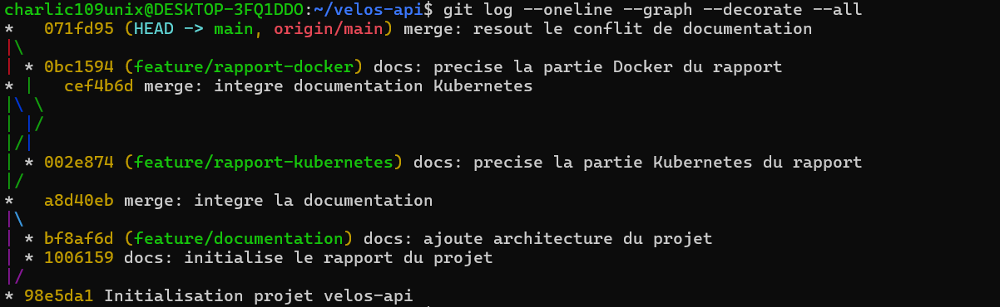
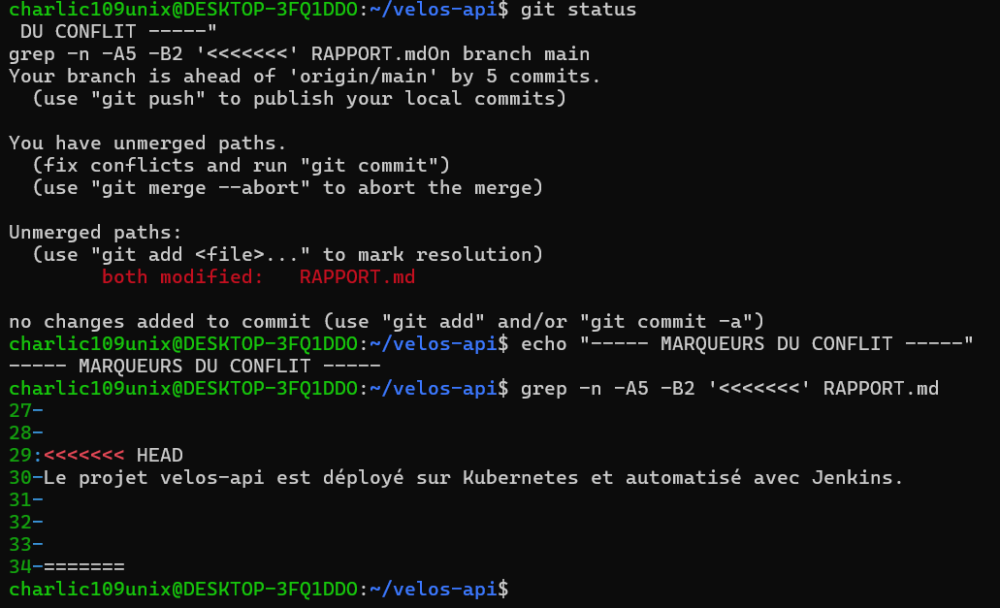
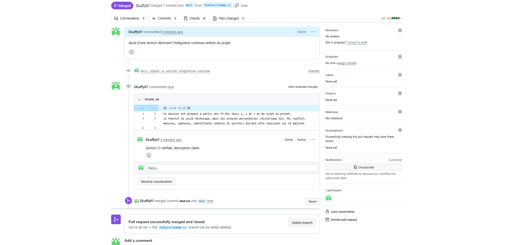
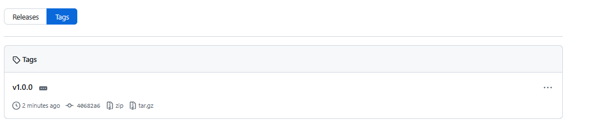
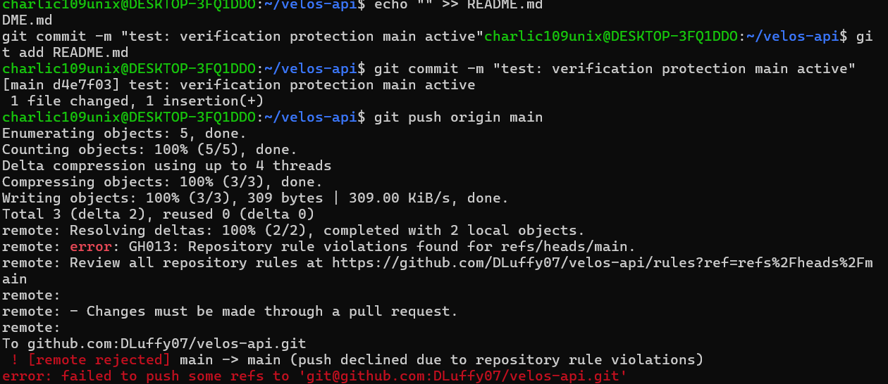

---

## 4. Jalon 2 · Docker

L'API est construite à partir d'une image Python officielle. Le Dockerfile final utilise plusieurs étapes : une étape prépare les dépendances, une étape exécute les tests et l'étape finale ne conserve que ce qui est nécessaire à l'exécution.

### Mesure du cache de construction

L'ordre du Dockerfile a été choisi pour copier et installer les dépendances avant de copier le code applicatif. Ainsi, une modification de `app.py` ne force pas la réinstallation des dépendances.

Lors d'un test où le contenu de `app.py` a réellement été modifié, les étapes liées à `requirements.txt` et à l'installation des dépendances sont restées en cache tandis que la copie du code a été rejouée. La construction optimisée mesurée a pris environ **2,26 s**. Des reconstructions entièrement mises en cache ont également été observées autour de **1,35 à 1,80 s**.

| Situation observée | Durée mesurée |
|---|---:|
| Reconstruction avec cache déjà disponible | ≈ 1,35 à 1,80 s |
| Modification réelle de `app.py`, dépendances toujours en cache | ≈ 2,26 s |

Ces mesures dépendent de la machine et de l'état du cache ; l'élément important est que la modification du code ne déclenche pas une nouvelle installation des dépendances.

### Taille de l'image

J'ai comparé une construction naïve à l'image finale multi-stage.

| Version | Taille |
|---|---:|
| Version naïve, un seul étage | **1,63 GB** |
| Version finale multi-stage | **195 MB** |

L'image finale est donc environ huit fois plus petite que la version naïve.

**Ce que le fichier `.dockerignore` évite d'envoyer :** les environnements virtuels, caches Python, fichiers Git, fichiers temporaires et éléments inutiles au contexte de construction. Cela réduit le contexte envoyé à Docker et évite également d'embarquer accidentellement des fichiers locaux sensibles.

**Exécution non-root :** l'utilisateur `appli`, UID `1001`, est créé dans l'image finale. Les commandes `whoami` et `id` exécutées dans le conteneur confirment que l'application ne fonctionne pas avec l'utilisateur `root`.

**Docker Compose :** la pile contient l'API et PostgreSQL. La base n'expose aucun port directement sur l'hôte. L'API communique avec elle grâce au nom de service `db`. Un healthcheck PostgreSQL et `depends_on` permettent d'attendre que la base soit saine avant le démarrage de l'API. Sur la machine hôte, l'API Compose est disponible sur le port `8001`.

**Comment j'ai prouvé la persistance :** j'ai ajouté une station `Station Persistence` dans PostgreSQL, arrêté puis recréé la pile Compose sans supprimer le volume nommé. Après le redémarrage, la station était toujours retournée par l'API. Les données sont donc stockées indépendamment du cycle de vie du conteneur PostgreSQL.

**Ce que je retiens :** Docker rend l'environnement reproductible, mais la qualité de l'image dépend fortement de sa construction. Le cache, le multi-stage, l'exécution non-root, le healthcheck et les volumes apportent respectivement rapidité, réduction de taille, sécurité, fiabilité au démarrage et persistance.

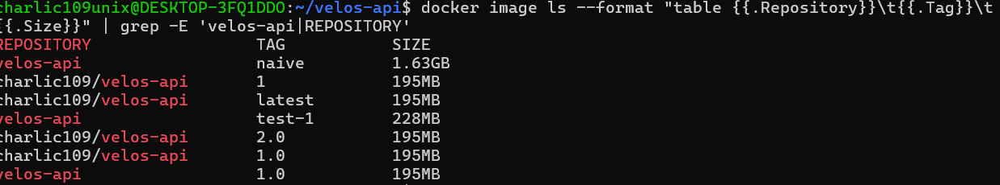
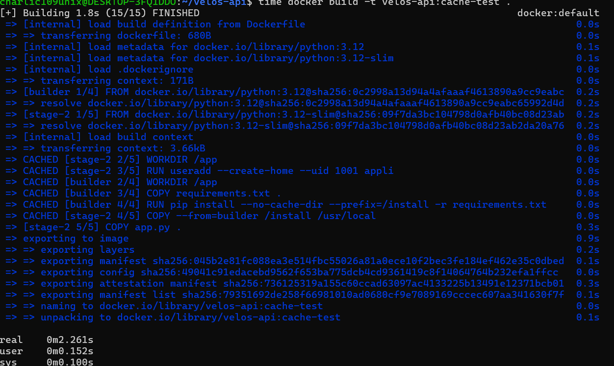
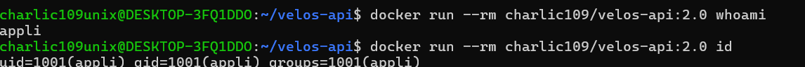
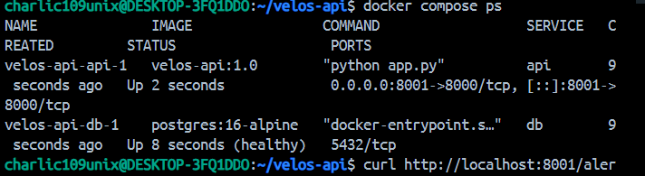
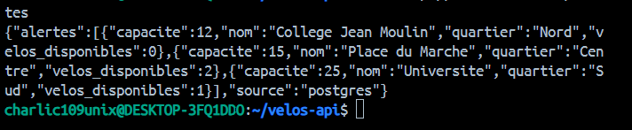
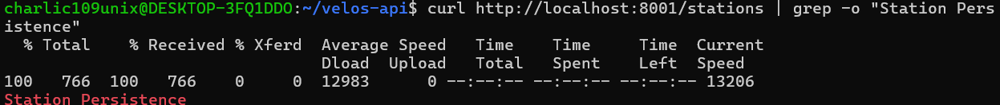

---

## 5. Jalon 3 · Kubernetes

J'ai créé un cluster Kind dédié nommé `velos`, composé d'un control-plane et de deux workers. Les nœuds ont été vérifiés dans l'état `Ready`.

**Comment j'ai obtenu le port 8081 vers le cluster :** le fichier `k8s/kind-cluster.yaml` configure sur le control-plane un `extraPortMappings` entre le port hôte `8081` et le port `30081` du nœud Kind. Le service `velos-api` est un `NodePort` utilisant précisément `30081`. Une requête vers `localhost:8081` atteint donc réellement l'API déployée dans Kubernetes.

**Où vit le mot de passe, et pourquoi ce n'est pas un coffre-fort :** le mot de passe PostgreSQL n'est présent dans aucun fichier versionné. Le Secret `velos-secret` a été créé directement avec `kubectl` en ligne de commande, puis référencé dans les manifests. Un Secret Kubernetes évite de placer la valeur en clair dans les manifests Git, mais ce n'est pas un véritable coffre-fort : Kubernetes stocke principalement ces valeurs encodées et leur sécurité dépend notamment des droits d'accès au cluster et de la configuration d'etcd. Pour une infrastructure de production, un gestionnaire de secrets dédié serait préférable.

**Disponibilité et montée en charge :** le déploiement de l'API a d'abord fonctionné avec plusieurs réplicas, puis a été mis à l'échelle à quatre pods. Les quatre réplicas ont été répartis sur les deux workers `velos-worker` et `velos-worker2`.

**Ce que j'ai observé en supprimant un exemplaire sous trafic :** pendant une boucle de requêtes HTTP, j'ai supprimé volontairement un pod de l'API. Les requêtes ont continué à répondre et Kubernetes a immédiatement créé un nouveau pod afin de revenir au nombre de réplicas demandé. Cela illustre le rôle du Deployment : maintenir l'état désiré malgré la disparition d'un pod.

**La mise à jour vers la version 2 :** j'ai publié `charlic109/velos-api:2.0`, contenant notamment la route `/alertes` et une version `2.0` visible sur `/sante`. Pendant le rolling update, une boucle de trafic a continué à recevoir des réponses HTTP sans interruption tandis que les nouveaux pods remplaçaient progressivement les anciens.

**Le retour arrière :** après le déploiement de la version `2.0`, j'ai consulté l'historique avec `kubectl rollout history`, puis exécuté `kubectl rollout undo`. Kubernetes a créé une nouvelle révision correspondant au retour vers l'image `charlic109/velos-api:1.0`. L'API a ensuite de nouveau répondu avec le comportement de la version précédente.

**Ce que je retiens :** Kubernetes ne se limite pas au lancement de conteneurs. Les Deployments, Services, probes et ReplicaSets permettent d'obtenir découverte réseau, réplication, auto-réparation, mises à jour progressives et retours arrière contrôlés.

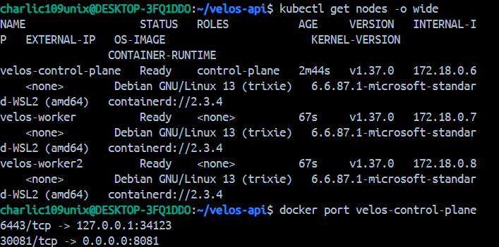
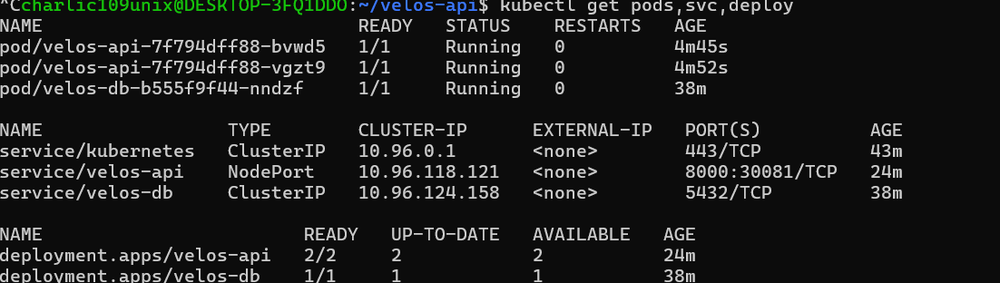
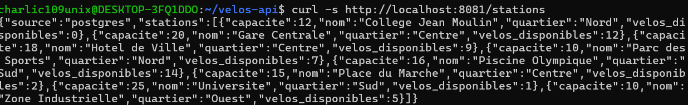
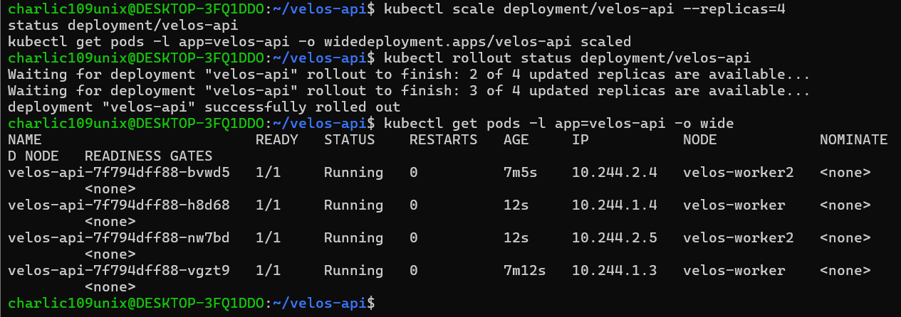
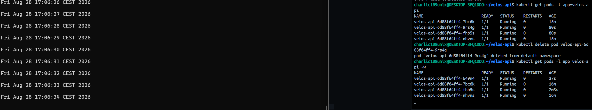
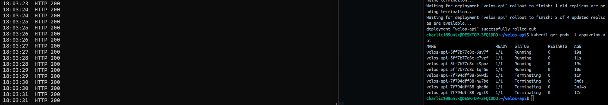
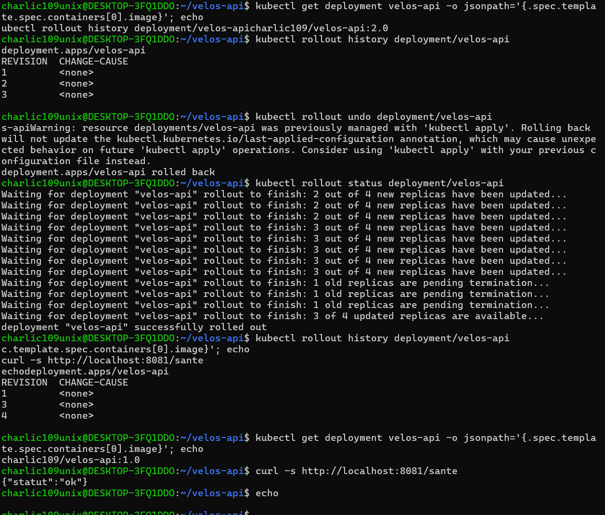

---

## 6. Jalon 4 · Jenkins

Le dernier jalon automatise la chaîne complète avec un `Jenkinsfile` versionné dans le dépôt.

**Mes tests :** deux tests Pytest sont exécutés. Le premier vérifie que `/sante` répond en HTTP 200 avec le statut et la version attendus. Le second vérifie `/alertes` : code HTTP, source en mémoire et sélection correcte des stations ayant au maximum deux vélos disponibles. Les tests utilisent le client de test Flask et le mode mémoire de l'application ; ils peuvent donc s'exécuter sans base PostgreSQL externe.

**Les quatre étapes de mon pipeline :**

1. `Tester` construit l'étape Docker `test`, dans laquelle Pytest est exécuté.
2. `Construire` crée l'image finale de l'application.
3. `Publier` s'authentifie auprès de Docker Hub via Jenkins Credentials puis publie l'image.
4. `Deployer` modifie l'image du Deployment Kubernetes et attend la fin effective du rollout.

**Comment mes images sont étiquetées, et pourquoi :** Jenkins utilise le numéro du build comme tag unique, par exemple `charlic109/velos-api:5` ou `charlic109/velos-api:7`. Chaque exécution peut ainsi être reliée à une image précise. Le tag `latest` peut être pratique, mais le numéro de build fournit la traçabilité nécessaire pour savoir exactement quelle image a été produite et déployée.

**Gestion des identifiants :** les identifiants Docker Hub et le kubeconfig du cluster `velos` sont enregistrés dans Jenkins Credentials. Les valeurs ne sont pas écrites dans le `Jenkinsfile`. Le kubeconfig utilisé par le pipeline correspond au cluster final `velos`.

**La ligne qui rend mon pipeline honnête :**

```groovy
sh 'kubectl rollout status deployment/velos-api --timeout=180s'
```

Cette commande oblige Jenkins à attendre que Kubernetes confirme la réussite du déploiement. Sans elle, le pipeline pourrait devenir vert immédiatement après `kubectl set image`, alors que les nouveaux pods seraient éventuellement en erreur ou incapables de devenir prêts.

### Le rouge utile

J'ai volontairement introduit une régression dans `/sante` en remplaçant le statut attendu `ok` par `ko`, sans modifier le test. Après fusion de cette modification dans `main`, Jenkins a lancé le build **#6**.

Le stage `Tester` a échoué. Jenkins n'a donc exécuté ni `Construire`, ni `Publier`, ni `Deployer`. Avant cette expérience, Kubernetes utilisait l'image `charlic109/velos-api:5`. Après l'échec du build #6, j'ai vérifié le Deployment : il utilisait toujours exactement `charlic109/velos-api:5`. Le pipeline a donc empêché une régression de parvenir jusqu'au cluster.

**L'extrait de journal qui donne la cause :**

```text
FAILED tests/test_app.py::test_sante
{'statut': 'ko'} != {'statut': 'ok'}
1 failed, 1 passed
```

J'ai ensuite corrigé `/sante` sur une nouvelle branche et fusionné la correction par Pull Request. Le build **#7** est redevenu vert et a exécuté les quatre étapes. La vérification finale dans Kubernetes montre l'image :

```text
charlic109/velos-api:7
```

avec quatre pods API `Running`. La route `/sante` répond de nouveau :

```json
{"statut":"ok","version":"2.0"}
```

**Ce que je retiens :** une CI/CD utile ne consiste pas simplement à automatiser un `docker build`. Elle doit arrêter la chaîne le plus tôt possible en cas d'erreur, ne jamais publier ou déployer une version dont les tests échouent, protéger les identifiants et attendre la confirmation réelle de Kubernetes avant d'annoncer un succès.

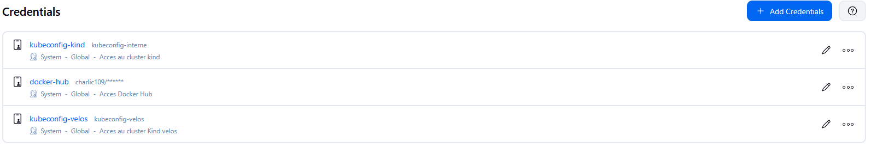
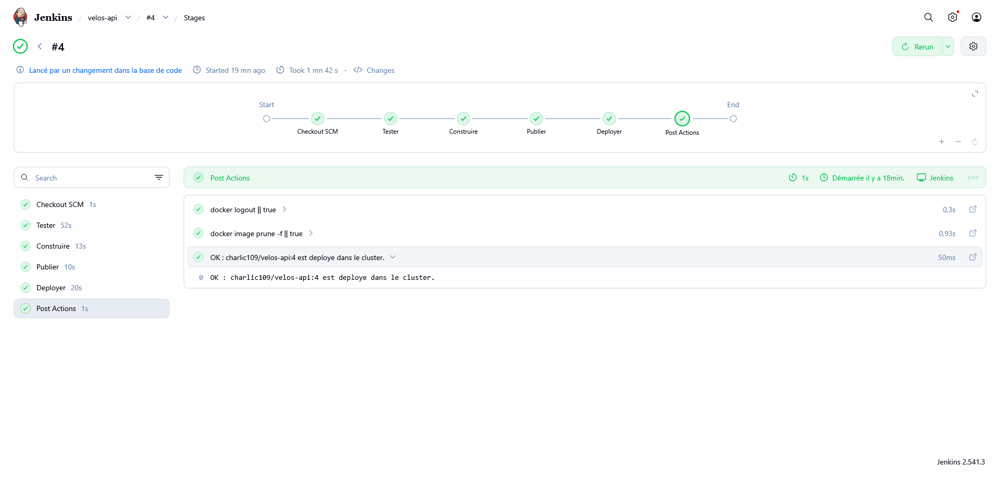
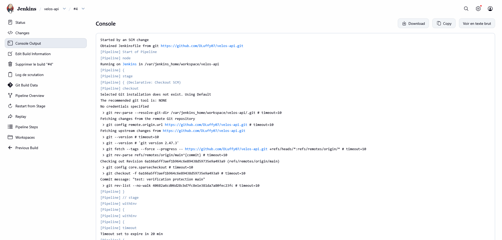
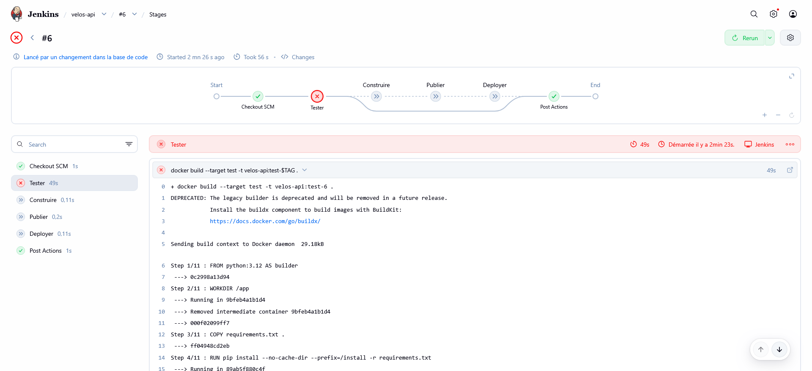
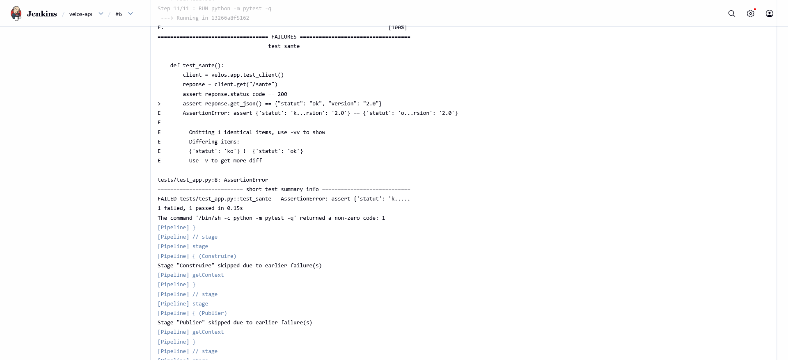
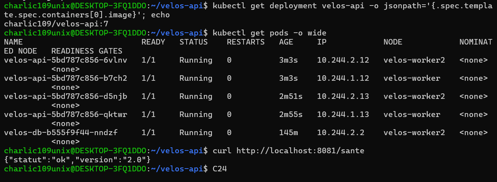

---

## 7. Mes trois difficultés

| # | Symptôme observé | Cause réelle | Correction apportée |
|---|---|---|---|
| 1 | L'API Kubernetes ne répondait pas sur `localhost:8081`. | Mon ancien cluster Kind `devops` n'avait qu'un mapping du port hôte `8080` vers `30080`. | J'ai conservé l'ancien cluster et créé un cluster dédié `velos` avec un mapping réel `8081 -> 30081`. |
| 2 | Le pod PostgreSQL restait bloqué à cause d'un montage impossible. | Le Deployment attendait un ConfigMap nommé `velos-init`, alors que le ConfigMap créé portait un autre nom. | J'ai aligné le nom du ConfigMap sur `velos-init` et recréé/appliqué la ressource attendue. |
| 3 | Le premier pipeline Jenkins vert ne modifiait pas le cluster final `velos`. | Jenkins utilisait encore le credential `kubeconfig-kind`, correspondant à l'ancien cluster. | J'ai créé le credential `kubeconfig-velos`, modifié le `Jenkinsfile`, fusionné cette correction dans `main`, puis vérifié qu'un nouveau build déployait bien son tag unique sur `velos`. |

Une difficulté supplémentaire rencontrée pendant Kubernetes a été un `ImagePullBackOff` : le manifest demandait précisément `charlic109/velos-api:1.0` alors que ce tag exact n'était pas disponible dans les nœuds Kind. Le chargement de l'image avec le bon tag a permis de démarrer correctement les pods.

---

## 8. Ce qui n'est pas fait

Les fonctionnalités obligatoires du projet ont été réalisées : historique Git et protection de `main`, conteneurisation, environnement Compose avec persistance, cluster Kubernetes multi-nœuds, réplication et rolling update, ainsi que pipeline Jenkins avec démonstration d'un échec bloquant le déploiement.

La mesure du cache Docker pourrait toutefois être rendue encore plus rigoureuse en chronométrant deux Dockerfiles strictement comparables, l'un volontairement mal ordonné et l'autre optimisé, dans des conditions de cache identiques. Les mesures réalisées pendant le projet montrent bien la réutilisation du cache des dépendances lors d'une modification du code, mais un protocole de benchmark dédié donnerait une comparaison encore plus nette.

---

## 9. Assistance utilisée

J'ai utilisé la documentation et les supports du cours pour les notions et commandes liées à Git, Docker, Docker Compose, Kubernetes et Jenkins.

J'ai également utilisé **ChatGPT** comme assistant pour m'accompagner pendant la réalisation : explication des erreurs rencontrées, proposition de commandes de diagnostic, aide à la structuration des manifests et du pipeline, vérification des résultats obtenus et mise en forme du rapport. Les commandes ont été exécutées et leurs résultats vérifiés sur mon propre environnement avant d'être conservés dans le projet.

GitHub, Docker Hub et les interfaces Jenkins ont été utilisés pour gérer respectivement le dépôt et les Pull Requests, les images publiées et l'exécution de la CI/CD.

---

## 10. Si j'avais deux jours de plus

Je commencerais par automatiser davantage la gestion de l'infrastructure et des secrets. Le cluster pourrait être complété par un gestionnaire de secrets dédié et par une gestion plus stricte des droits Kubernetes.

Je renforcerais ensuite le pipeline avec des contrôles supplémentaires : lint du code Python, analyse de vulnérabilités de l'image, vérification des manifests Kubernetes et stratégie de tags combinant numéro de build et commit Git.

Enfin, je mettrais en place un benchmark Docker reproductible pour comparer précisément plusieurs stratégies de cache et j'ajouterais de l'observabilité au cluster, avec métriques et logs centralisés. Cela permettrait de passer d'un projet fonctionnel et automatisé à une chaîne plus proche d'un environnement de production.
